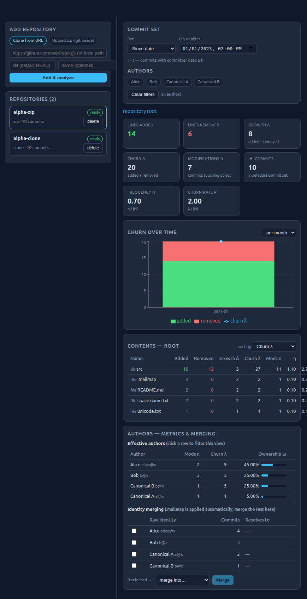

# Repo Analysis Tool (RAT)

A web dashboard that ingests git repositories — either as a **zip upload containing `.git`** or by
**cloning from a URL** — and computes line-based contribution metrics for files, directories, whole
repositories, arbitrary commit sets and authors.



## Highlights

- **Ingestion** — upload a zip archive that contains `.git`, or clone any (public) repository URL;
  multiple repositories are managed side by side, imports run in the background with live progress.
- **Filters everywhere** — repository selector, author multi-select, file/directory browser and a
  commit-set builder: *all commits* (`H̄`), *since date* (`H_t`), *date range* (`H_i,j`) or a
  *hand-picked commit list*.
- **The full metric family** — for every file, directory, repository, commit set and author:
  lines added `l+`, lines removed `l−`, growth `δ = l+ − l−`, churn `λ = l+ + l−`,
  modifications `n`, modification frequency `η = n / |H|`, churn rate `ρ = λ / |H|`, and author
  ownership `ω = λ_{H,o,a} / λ_{H,o}`, plus a churn-over-time chart per object.
- **Author identity handling** — `.mailmap` is applied automatically and remaining duplicate
  identities can be merged (and unmerged) directly in the UI.
- **Any ref** — re-analyze an existing clone at any branch, tag or commit hash; `H̄` is always
  “all non-merge commits reachable from the selected ref”.

## Git correctness rules (exactly as specified)

| Rule | Implementation |
| --- | --- |
| Only non-merge commits reachable from the ref | `git log --no-merges <ref>` |
| Root commit diffed against the empty tree | `--root` |
| Rename detection at 50 % similarity; changes attributed to the **new** path | `-M50%`, rename entries parsed from `--numstat -z` |
| Binary files excluded from all metrics | `-`/`-` numstat rows skipped (git's own detection) |
| Deletions recorded as removals on the deleted path | `--numstat` counts stored on the path |
| `.mailmap` merging | `%aN`/`%aE` format placeholders (git applies the mailmap) |
| Manual author merging | `authors.canonical_id`, resolved transitively at query time |
| Directory metrics = recursive sum over children | each file delta is rolled up into every ancestor directory (and the root) during import |

## Quick start

Requires **Python 3.10+** and **Node 18+**.

```bash
# 1. backend dependencies
python3 -m venv .venv
.venv/bin/pip install -r backend/requirements.txt

# 2. build the dashboard
cd frontend && npm install && npm run build && cd ..

# 3. run (serves API + dashboard on one port)
cd backend && ../.venv/bin/uvicorn app.api:app --port 8000
```

Open <http://127.0.0.1:8000>.

For frontend development, run `npm run dev` inside `frontend/` (it proxies `/api` to port 8000)
while the backend runs with `--reload`.

## Architecture

```
backend/app/
  analyzer.py   git ingest engine: one streaming `git log --numstat -z` pass per repo,
                stores per-commit / per-object deltas (plus directory rollups) in SQLite
  metrics.py    all metrics as SQL sums over selectable commit sets and author filters
  api.py        FastAPI endpoints (repos, authors, tree, metrics, commits, re-import)
  ingest.py     zip extraction (zip-slip safe) and full clones
  db.py         SQLite schema
frontend/src/   React + Vite + Recharts dashboard
tests/          engine tests and real-repo validation
data/           runtime data: SQLite database + repository clones (git-ignored)
```

Because every metric is a pure sum over stored deltas, changing filters never re-reads the
repository — it just changes the `WHERE` clause.

## API overview

| Endpoint | Purpose |
| --- | --- |
| `POST /api/repos` | add a repository (multipart: `file` zip, or `url` + optional `ref`/`name`) |
| `GET /api/repos`, `GET /api/repos/{id}`, `DELETE /api/repos/{id}` | manage repositories |
| `POST /api/repos/{id}/reimport` | re-analyze the clone at another ref (branch/tag/hash) |
| `GET /api/repos/{id}/authors` · `POST .../authors/merge` · `POST .../authors/unmerge` | identity management |
| `POST /api/tree` | directory listing with per-child metrics (`repo_id`, `path`, `is_dir`, `commit_set`, `author_ids`) |
| `POST /api/metrics/authors` | per-author modifications, churn, ownership |
| `POST /api/metrics/timeseries` | `added`/`removed`/`churn` per day/week/month |
| `GET /api/repos/{id}/commits` | commit list (search) for the manual commit-set picker |

`commit_set` is `{mode: all}` or `{mode: since, since}` or `{mode: range, start, end}` or
`{mode: list, hashes:[...]}`; `author_ids` selects effective (merged) authors.

## Tests & validation

**Engine tests (exact values)** — a synthetic repository with hand-computed metrics covering
renames (rename+edit and pure rename), deletions, binary files, empty commits, `.mailmap` merging,
space/unicode paths, every commit-set mode, author filters and manual merges:

```bash
python3 tests/make_fixture.py && python3 tests/test_engine.py   # 48/48 checks
```

**Real-repo validation** — cross-checks the engine against independent `git` pipelines (the same
kind of check the brief’s sample values use):

```bash
git clone --quiet https://github.com/DaveGamble/cJSON.git && python3 tests/validate_repos.py cJSON
```

For each repository it verifies:
1. repository-level totals against an independent `git log --numstat` sum,
2. author commit counts against `git shortlog -s -e` (both mailmap-aware),
3. per-commit `(added, removed)` values at individually sampled **commit hashes** against `git show --numstat`.

Results on the reference repositories:

| Repository | Commits analyzed | Repository totals (engine = git) | Author identities | Per-commit samples |
| --- | --- | --- | --- | --- |
| cJSON | 955 | 46 377 added / 11 211 removed ✓ | 101 ✓ | 25/25 hashes ✓ |
| Redis | 11 875 | 1 110 390 added / 500 315 removed ✓ | 976 ✓ | 25/25 hashes ✓ |
| git | 61 101 | 4 070 371 added / 2 375 604 removed ✓ | 2 485 ✓ | 25/25 hashes ✓ |

The full `git/git` history (61 101 non-merge commits) imports in about a minute and a half — under
the Python engine, one streaming pass, no temporary files.

## Notes

- Tested with git 2.43, Python 3.12, Node 18.
- Imports are idempotent: re-importing or changing the ref replaces the stored data for that repository.
- Zip uploads are validated against path traversal and must contain a `.git` directory.
